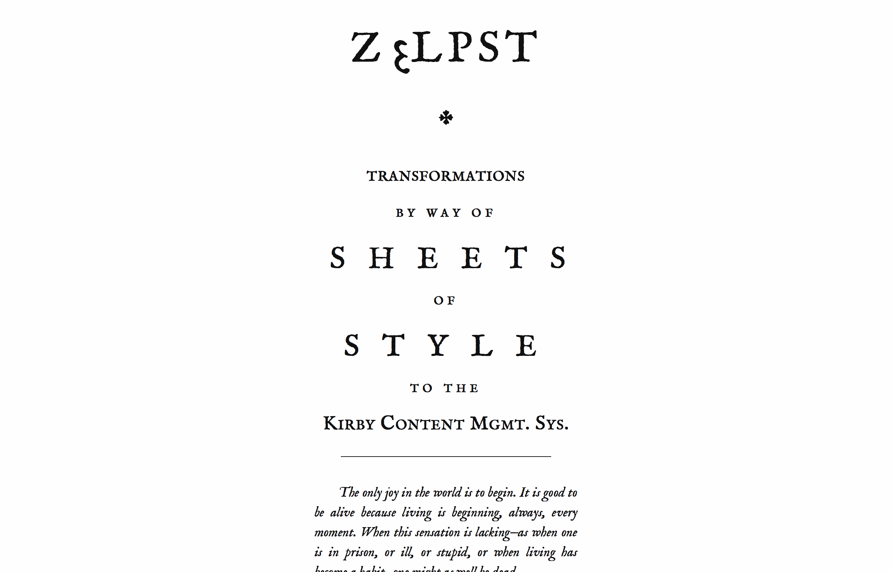

# zεlpst

zεlpst is my personal website/blog at http://zelp.st and http://zelpst.de.
The site is running [Kirby](http://getkirby.com/), a file-based CMS.

## OCTAVO

[OCTAVO](http://zelp.st/blog/octavo-theme) is a theme for the Kirby CMS,
originally inspired by a blog post by Clive Thompson, [Why 18th century books looked like smartphone screens](http://www.collisiondetection.net/mt/archives/2014/02/_thats_one_of_t.php).

Right now, OCTAVO is hardly more than an experiment. Consider it to be still
in Alpha. Use at your own risk.

### Theme-specific fields for blog posts

To generate the title style without resorting to images, the default template
of OCTAVO relies on Markdown Extra and currently uses these separate fields:

- ´title_styled´: title in Markdown format; make each line ´h1´, i.e. begin each with a ´#´, and set each lines style by adding one of the specific CSS classes (see below) in Markdown Extra, e.g. ´{.em}´
-  ´subtitle´: to achieve the look of my posts, make it a blockquote
-  ´city´, ´borrow´, ´author´: for the book “imprint” in the format “\[city\]: Printed for \[author\], in \[borrow\]”
-  ´year_romanized´: well, I know… (see below)

### CSS Classes for styling title lines

## To Dos aka “Yes, I know…”

This was a pretty quick hack in a way, so there are a lot of things I would like
to improve or fix even without you having to tell me. Do still tell me though if
you have ideas or think these ones here are bad:

- create ´year_romanized´ programmatically from publishing ´date´ field
- maybe not call it ´subtitle´ and always make it a blockquote?
- put all theme-specific fields in one ´octavo´ YAML field (purpose: make clear this is theme-specific data, both in content markup and template code, possibly allowing to identify which theme CSS to use when having multi-theme blog (see next idea)
- idea: as it will be hard to impossible to only come up with articles that match this very specific, historic design, I think of ways to give myself a way to easily tell Kirby to use a specific theme for specific blog posts; first step will be to name all theme-specific files accordingly unique, then create a “theme-agnostic” homepage
- fix layout issues on devices with very small width

## License

You are free to use, learn from, improve my own changes and additions to
the Kirby CMS basis which make my blog personal. Where applicable, I include
license informations in comments within the source code.

You are **not**, however, allowed to use the entirety of the code, i.e. the
Kirby platfiorm, to run your own blog without acquiring a Kirby license first!

*Please refer to the [Kirby website](http://getkirby.com/), the original
Readme `kirby.md` and of course `license.md` for informations about using
and licensing Kirby CMS.*
